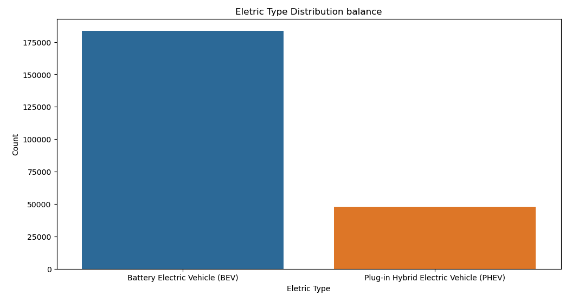
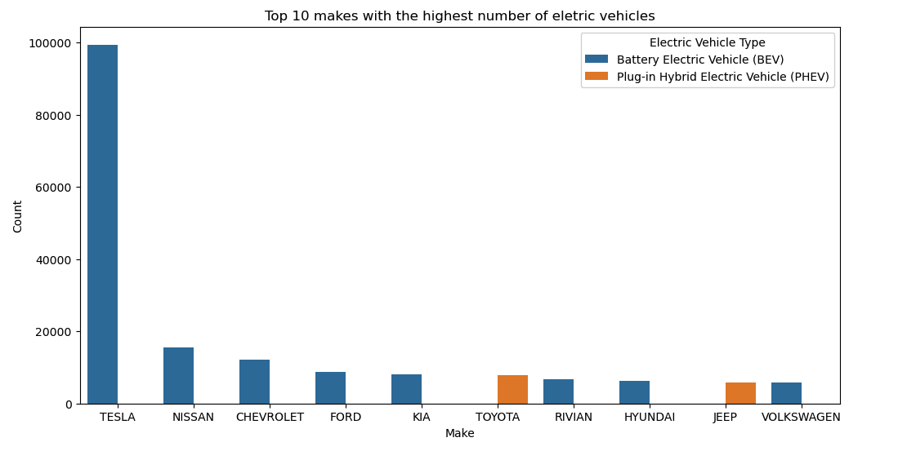
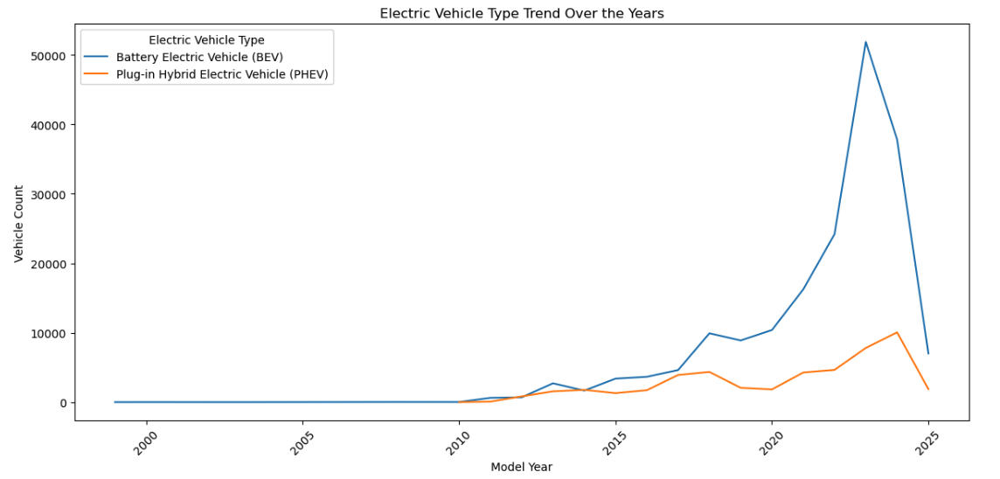
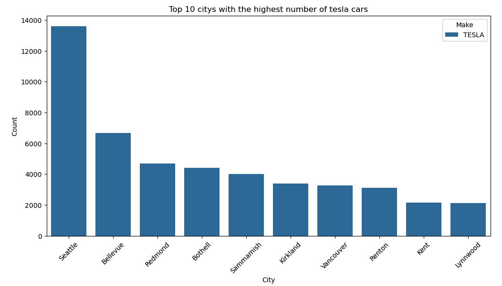
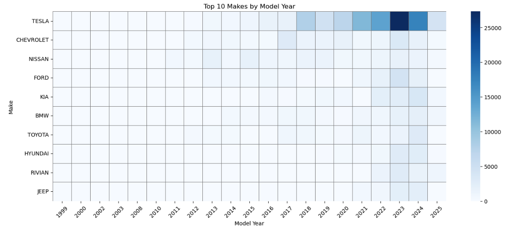

# 🔋 Electric Vehicle Market Analysis (EDA)

This project explores electric vehicle adoption trends using a real-world dataset. The goal is to uncover insights into how electric cars are distributed across regions, brands, and time — and understand what factors might be driving their growth.

---

## 📄 Executive Summary

### 🚗 Problem Statement

Electric vehicle (EV) adoption has grown rapidly in recent years, but that growth varies by region, vehicle type, and manufacturer. Understanding these patterns helps identify opportunities for expansion, marketing strategy, and infrastructure investment.

This project uses exploratory data analysis (EDA) techniques to answer key questions such as:

- Where are electric vehicles most concentrated?
- Which brands are leading the market?
- How has EV adoption evolved over time?
- Are buyers leaning toward full electric or hybrid options?

---

## 📊 Visual Insights

### 🔌 BEV vs. PHEV Distribution

This bar chart compares the number of Battery Electric Vehicles (BEVs) and Plug-in Hybrid Electric Vehicles (PHEVs). The distribution is clearly skewed toward BEVs, reflecting increased consumer preference for fully electric options in recent years.

---

### 🚗 Top Car Makes by Count

Tesla dominates the dataset by a wide margin, followed by Nissan and Chevrolet. Traditional automakers are beginning to gain ground, but the gap is still significant, particularly in newer model years.

---

### 📈 Growth Over Time by EV Type

This line chart shows how BEVs have surged in popularity since 2020, outpacing PHEVs. This aligns with market trends and growing support for full electrification in infrastructure and policy.

---

### 🏙️ Tesla Vehicles by City

Seattle has the highest concentration of Teslas, but interestingly, Vancouver — a city with high EV adoption — shows much lower Tesla counts. This suggests an opportunity for market expansion.

---

### 📊 Top Makes Over Time (Heatmap)

Tesla takes the lead starting around 2020, with other brands like Nissan and Chevrolet holding steady over time. Newer brands like Rivian begin to emerge in recent years.

---

## 🛠️ Tools & Technologies

- Python: pandas, numpy
- Visualization: matplotlib, seaborn, plotly
- Geo analysis: plotly.express.scatter_geo
- Notebook: JupyterLab / VSCode

---

## 🚀 Future Improvements

- Include EV pricing and profitability analysis
- Compare cities with charging station infrastructure
- Forecast future adoption with time-series modeling
- Add income/demographic overlays for deeper regional insight

---

## 👤 About the Author

**Matheus**  
Business student and aspiring data analyst focused on using data storytelling to reveal patterns and support smart decisions.

[LinkedIn](https://www.linkedin.com/in/matheus-cavalcanti-b413361b8/) 

---

> ⭐ Found this project useful? Star the repo to support it or share it with others!

